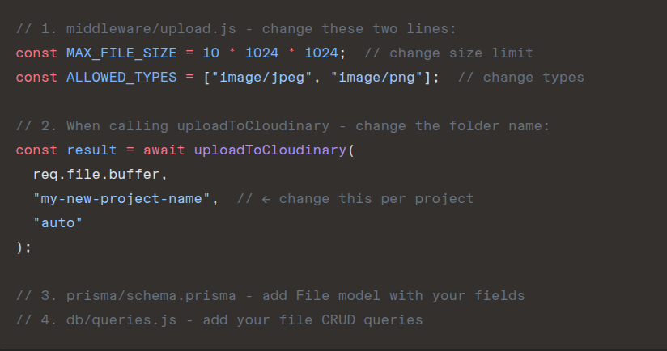

# Updated template structure:

express-prisma-template/
├── config/
│ ├── passport.js ← auth (template)
│ └── cloudinary.js ← NEW (template)
├── controllers/
│ └── authController.js ← auth (template)
├── db/
│ ├── prisma.js ← db client (template)
│ └── queries.js ← starter queries (template)
├── middleware/
│ ├── auth.js ← route guards (template)
│ └── upload.js ← NEW multer config (change limits/types)
├── utils/
│ ├── cloudinaryUpload.js ← NEW upload/delete helpers (template)
│ └── multerErrorHandler.js ← NEW error handler (template)
├── prisma/
│ └── schema.prisma ← edit per project
├── routes/
│ ├── index.js
│ └── auth.js
├── views/
│ ├── partials/
│ │ ├── header.ejs
│ │ └── footer.ejs
│ ├── index.ejs
│ ├── signup.ejs
│ ├── login.ejs
│ └── error.ejs
├── public/
│ └── css/
│ └── output.css
├── app.js
├── input.css
├── tailwind.config.js
├── .env ← never commit
├── .env.example ← commit this
├── .gitignore
└── package.json

# First Time Setup:

1. Clone template
   git clone your-template-url my-new-project
   cd my-new-project

2. Install dependencies
   npm install

3. Set up .env
   cp .env.example .env
   fill in your DATABASE_URL and SESSION_SECRET

4. Edit prisma/schema.prisma
   add your project-specific models

5. Create database tables
   npx prisma migrate dev --name init

6. Start building
   npm run dev

# The Only Things You Change Per Project:

TEMPLATE FILES (copy and forget):
config/cloudinary.js → cloudinary connection setup
utils/cloudinaryUpload.js → uploadToCloudinary() and deleteFromCloudinary()
utils/multerErrorHandler.js → handleUpload() error wrapper
middleware/upload.js → multer config (just change size + types)

MASTER THESE CONCEPTS:
→ enctype="multipart/form-data" on any form with file input
→ req.file.buffer → the file data from multer memory storage
→ result.secure_url → save this in database (to display/download file)
→ result.public_id → save this in database (to delete from cloudinary later)
→ Always delete from Cloudinary AND database together

CHANGE PER PROJECT:
→ MAX_FILE_SIZE in upload.js
→ ALLOWED_TYPES in upload.js
→ folder name in uploadToCloudinary()
→ File model fields in schema.prisma
→ File queries in queries.js
